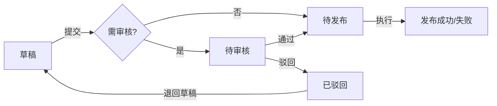

# AI 多平台内容自动发布 — 日常使用手册

适用版本：MVP（小红书 + 抖音 + 快手）  
API 地址：http://127.0.0.1:8765  
管理页：http://127.0.0.1:8765/app/  
Swagger：http://127.0.0.1:8765/docs  

部署（Mac / Windows / Linux / Docker）：见 [deployment.md](./deployment.md)

---

## 1. 启动与停止

**macOS / Linux：**

```bash
cd ai-publish
./start.sh
```

**Windows（PowerShell）：**

```powershell
cd ai-publish
.\start.ps1
```

- 默认账号见下表；停止：终端 `Ctrl+C`

| 角色 | 账号 | 默认密码 |
|------|------|----------|
| 管理员 | `admin` | `admin123` |
| 运营 | `operator` | `operator123` |
| 审核主管 | `reviewer` | `reviewer123` |
| 只读 | `viewer` | `viewer123` |

> 密码经 bcrypt 加密存储，**修改后无法在系统中查看明文**。生产环境请尽快修改默认密码。

---

## 2. AI 模型配置（自动匹配）

系统启动时会**自动检测**本机可用模型，并写入 `backend/data/ai_runtime.json`。

### 检测优先级

| 类型 | 优先级 | 说明 |
|------|--------|------|
| 文案 | 本地 Ollama → 通义 → 混元 → OpenAI → DeepSeek → Moonshot → Stub | 本机已检测到 `qwen3.6:latest` 等 |
| 文生图 | 通义万相 → **混元 HY-Image-V3.0** → OpenAI DALL·E → Stub | 本地 Ollama 暂无文生图模型 |

### 配置 API Key（`.env`）

```bash
# 通义（文案 + 万相文生图）
DASHSCOPE_API_KEY=sk-xxx

# OpenAI 或兼容代理
OPENAI_API_KEY=sk-xxx
OPENAI_BASE_URL=https://api.openai.com/v1

# DeepSeek / Moonshot 可选
DEEPSEEK_API_KEY=
MOONSHOT_API_KEY=

# 腾讯混元（OpenAI 兼容，控制台申请 API Key）
HUNYUAN_API_KEY=

# 本地 Ollama（默认已可用）
OLLAMA_BASE_URL=http://127.0.0.1:11434
```

修改 `.env` 后重启 `./start.sh`，或调用 `POST /api/ai/models/detect` 重新检测。

### 模型 API

```bash
# 登录拿 Token
TOKEN=$(curl -s -X POST http://127.0.0.1:8765/api/auth/login \
  -H 'Content-Type: application/json' \
  -d '{"username":"admin","password":"admin123"}' | python3 -c "import sys,json;print(json.load(sys.stdin)['access_token'])")

# 查看当前可用模型（含本机 Ollama + 远程 Key）
curl -s http://127.0.0.1:8765/api/ai/models -H "Authorization: Bearer $TOKEN" | python3 -m json.tool

# 手动切换文案模型（例如改用通义）
curl -s -X POST http://127.0.0.1:8765/api/ai/models/select \
  -H "Authorization: Bearer $TOKEN" \
  -H 'Content-Type: application/json' \
  -d '{"mode":"manual","text_provider":"tongyi","text_model":"qwen-plus"}'

# 恢复自动匹配
curl -s -X POST http://127.0.0.1:8765/api/ai/models/detect \
  -H "Authorization: Bearer $TOKEN"
```

---

## 3. 平台账号与 Cookie

支持 **小红书（xhs）**、**抖音（douyin）**、**快手（kuaishou）**。在 Vue「平台账号」页按平台筛选，新建账号后扫码登录。

**Docker 服务器：** 使用容器内 Chromium 无头打开登录页，二维码显示在管理页弹窗（无需本机 Chrome）。部署后若扫码不可用，执行 `bash scripts/install-playwright-browser.sh`。

**方式 A：从 sau 导入（推荐）**

```bash
cd ai-publish/backend && source .venv/bin/activate
python ../scripts/import_sau_cookie.py
```

**方式 B：Swagger 扫码**

`POST /api/platform-accounts/{id}/login`（需 `PLAYWRIGHT_HEADLESS=false`）

**校验：** `POST /api/platform-accounts/1/check-cookie` → `valid: true`

---

## 4. 发布一条图文（§4.1 流程）

推荐通过 **Vue 发布向导**（`/app/publish`）完成：

1. **主题与账号** — 选择平台（小红书/抖音/快手）、内容类型（图文/视频）、账号与主题  
2. **AI 文案** — 按平台模板生成标题、正文、标签等（可编辑）  
3. **AI 封面** — 图文：文生图；**小红书视频**：可选 3:4 视频封面（AI 生成/上传）；其他平台视频可跳过  
4. **素材确认** — 图文选图片；视频选/上传 MP4，小红书可附带封面图  
5. **排期提交** — 可选计划时间 → **保存草稿** 或 **提交待发布**  
6. 在 **发布任务** 页对 `待发布` 任务点击 **执行** — Playwright 发布  
7. `GET /api/publish-tasks/{id}/logs` — 查看步骤日志  
8. **草稿** 可点 **删除** 清理；**待审核**（需 `.env` 开启 `REQUIRE_CONTENT_REVIEW=true`）可 **通过/驳回**  

> 设置了 `publish_time` 的任务会在到点后**自动执行**（默认每 30 秒轮询，可通过 `SCHEDULER_POLL_INTERVAL_SECONDS` 调整）。未设置计划时间的任务仍需手动点「执行」。

### Swagger 等价流程

1. `POST /api/auth/login` → Authorize  
2. `POST /api/ai/text/generate` — 生成文案（含 `comment_guide`）  
3. `POST /api/ai/image/generate` — 可选，生成封面图  
4. `POST /api/materials/upload` — 或上传真实图片  
5. `POST /api/publish-tasks` — 创建任务，`submit: true`（进入待发布）  
6. `POST /api/publish-tasks/{id}/execute` — 手动触发发布  

---

## 5. 一键 E2E 脚本

```bash
cd ai-publish/backend && source .venv/bin/activate
python ../scripts/e2e_publish.py
```

---

## 6. Vue 管理后台

**生产模式（推荐）：**

```bash
cd ai-publish
./web.sh          # 构建前端
./start.sh        # 启动 API
```

浏览器打开：**http://127.0.0.1:8765/app/**

**开发模式（热更新）：**

```bash
# 终端 1
./start.sh

# 终端 2
./web.sh dev      # http://127.0.0.1:5173/app/
```

功能：概览、平台账号、AI 模型、素材库、发布任务、**发布向导**、系统设置。

> 发布流程：向导生成内容 → 提交待发布 → 任务页手动执行。文生图 Key 未配置时可跳过 AI 封面、改用手动上传。

### 用户与账号管理（阶段 E.1）

**个人改密：** 顶栏「修改密码」→ 输入原密码与新密码（所有已登录用户可用）。

**用户管理（仅管理员）：** 系统设置 → **用户管理**

- 新建用户：填写用户名、初始密码、角色
- 编辑：调整角色
- 重置密码：管理员为指定用户设置新密码
- 启用/禁用：禁用后该用户无法登录

**平台账号编辑（运营及以上）：** 平台账号页 → **编辑** → 可修改账号名与备注；只读角色（viewer）无编辑按钮。

**权限说明：** `viewer` 仅可查看；`reviewer` 仅可审核（无发布向导、无执行任务）；`operator` 可运营但无用户管理；`admin` 拥有全部权限。

### 内容审核（阶段 E.2）

在 **系统设置** 将 `require_content_review` 设为 `true` 后，发布向导「提交待发布」的任务会进入 **待审核**，不会直接进入待发布队列。



**审核入口：**

1. 侧栏 **内容审核** → 待审核 Tab：预览正文/素材，通过或驳回（驳回须填原因）
2. **审核历史** Tab：查看审核人、时间、结果与驳回原因
3. 发布任务页仍保留快捷通过/驳回按钮（运营与审核主管可用）

**验收步骤（开启审核）：**

1. 系统设置 → `require_content_review` = `true` → 保存
2. 运营账号提交一条任务 → 状态应为 `待审核`
3. 使用 `reviewer` / `reviewer123` 登录 → 仅有「内容审核」等只读/审核菜单，无「发布向导」「执行」
4. 在内容审核页通过 → 任务变为 `待发布`；运营或管理员可执行发布
5. 审核历史 Tab 可看到记录（含审核人、时间）

---

## 7. 简易 HTML 管理页（旧）

http://127.0.0.1:8765/admin/（若未构建 Vue 则可用）

---

## 8. 常见问题

| 问题 | 处理 |
|------|------|
| check-cookie 500 | 运行 `import_sau_cookie.py` 重新导入 Cookie |
| 文生图只有 1x1 占位图 | 配置 `DASHSCOPE_API_KEY` 或 `OPENAI_API_KEY` |
| execute 卡住 | 确认 Chrome 弹出且 Cookie 有效 |
| 标签「AI发布」被跳过 | 非阻塞，可换常见标签如「测试」 |

---

## 9. 下一步扩展

- **Vue 完整管理后台**：独立 change，基于现有 API
- **多平台**：抖音、快手已支持；视频号等待新增 `PlatformAdapter`
- **Docker 部署**：`docker compose up`（需 Docker Desktop）
